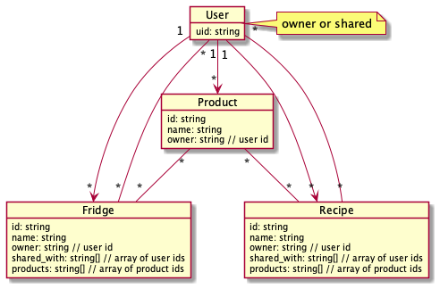

# Your Fridge

## Development environment

### Requirements

- node v14.x
- npm v7.x
- [firebase cli](https://firebase.google.com/docs/emulator-suite) v9.x

### Setup

```bash
# setup firebase emulators for dev
$ firebase emulators:start

# serve with hot reload at localhost:3000
$ yarn dev

# build for production
$ yarn generate
```

This app is bootstrapped with NuxtJS. For detailed explanation on how things work, check out their [documentation](https://nuxtjs.org).

## Document relationship overview


